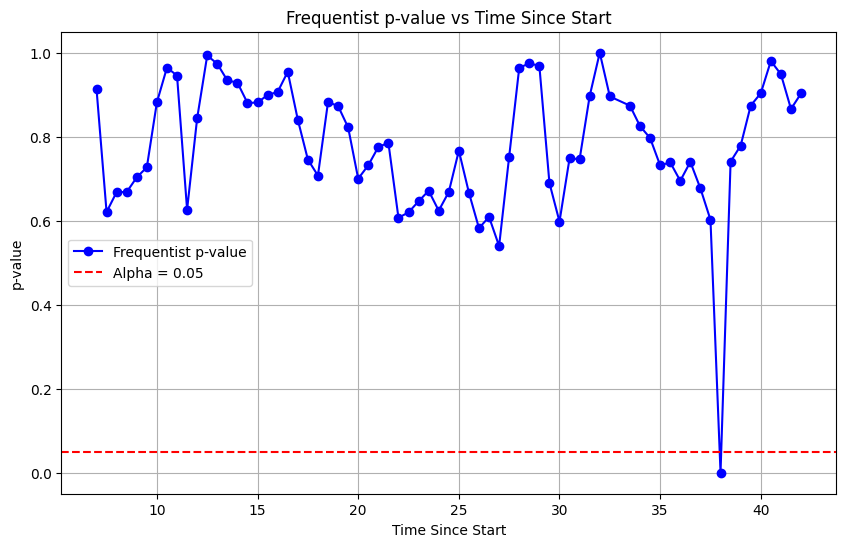

# Sequential A/B Testing: Frequentist vs Bayesian Analysis

> **Why you should stop peeking at p-values — and what to do instead.**

This project compares traditional Frequentist A/B testing with Bayesian Sequential Testing using the **ASOS Digital Experiments Dataset**. It demonstrates how continuous monitoring of p-values can produce misleading decisions and how Bayesian sequential methods provide a principled framework for early stopping.

---

## Overview

Traditional A/B testing assumes that statistical significance is evaluated only after a predetermined sample size or experiment duration. In practice, experiments are often monitored continuously, and decisions may be made as soon as a p-value crosses a significance threshold.

This practice, known as **peeking**, increases the probability of false positives and can lead to incorrect product decisions.

This project analyzes real-world experiment data to:

- Demonstrate the pitfalls of Frequentist sequential monitoring
- Implement Bayesian Sequential Testing using Monte Carlo sampling
- Compare stopping behavior between both approaches
- Estimate experiment time and user traffic savings from early stopping

---

## Tech Stack

- Python 3.11+
- NumPy
- Pandas
- SciPy
- Matplotlib
- Jupyter Notebook

---

## Dataset

This project uses the **ASOS Digital Experiments Dataset**, which contains time-series summary statistics from online A/B experiments.

The dataset contains:

- **78 experiments**
- **4 metrics per experiment**
- **312 experiment–metric streams**

Each observation includes:

- `count_c`
- `count_t`
- `mean_c`
- `mean_t`
- `variance_c`
- `variance_t`

Download the dataset from:

https://osf.io/64jsb/files/hq8sc

Place the downloaded file

```
asos_digital_experiments_dataset.csv
```

in the project root before running the notebook.

---

## Installation

Clone the repository:

```bash
git clone https://github.com/<your-username>/sequential-ab-testing-analysis.git
cd sequential-ab-testing-analysis
```

Install the required packages:

```bash
pip install numpy pandas scipy matplotlib
```

Launch the notebook:

```bash
jupyter notebook Sequential_Testing_Analysis.ipynb
```

---

# Analysis

## Part 1 — Frequentist Analysis: The Peeking Problem

Welch's t-test is computed at every available observation to simulate continuous monitoring of an experiment.

The notebook illustrates how p-values fluctuate throughout the experiment and how temporary statistical significance can disappear by the end of the test.

One notable example is **Experiment `036afc`**, whose p-value briefly falls below **0.05** during the experiment but finishes around **0.45**, demonstrating a classic false trigger that could have resulted in an incorrect deployment.

### Visual Evidence: Telemetry Loss Anomaly

Another interesting case is **Experiment `162a38` (Metric 1)**.

According to the ASOS Digital Experiments Dataset documentation:

> **The treatment mean entry for Experiment `162a38`, Metric 1, taken 38 days since the start of the experiment demonstrates a spike compared to both the control mean and the surrounding treatment observations, which could be the result of telemetry loss.**

This data anomaly briefly causes the Frequentist p-value to collapse to nearly **0.0** before immediately returning to its normal trajectory. Under continuous p-value monitoring, such a temporary anomaly could incorrectly signal statistical significance and trigger deployment of a feature that has no real effect.

<details>
<summary><strong> Show Image</strong></summary>

<br>



</details>

---

## Part 2 — Bayesian Sequential Analysis

A Bayesian Sequential Testing framework is implemented using Monte Carlo sampling.

For each observation, the notebook estimates:

- **P(Treatment > Control)** — Probability that the treatment outperforms the control.
- **Expected Loss** — Expected cost of deploying the treatment before sufficient evidence has been collected.

### Stopping Rules

| Condition | Decision |
|-----------|----------|
| Expected Loss < ε and P(Treatment > Control) > 0.95 | Stop and Deploy |
| Expected Loss < ε and P(Treatment > Control) < 0.05 | Stop and Rollback |
| Otherwise | Continue Experiment |

---

## Part 3 — Experiment Summary

For every experiment–metric stream, the notebook records:

- Final experiment outcome
- Whether a temporary false trigger occurred
- Bayesian stopping point
- Experiment duration saved
- User traffic saved

---

## Part 4 — Overall Results

The Bayesian framework is evaluated across all **312 experiment–metric streams**.

| Metric | Value |
|---------|------:|
| Total Streams Evaluated | 312 |
| Streams Stopped Early | 158 (50.6%) |
| Total Days Saved | ~5,567 |
| Total User Impressions Saved | ~2.65 Billion |

These results demonstrate that Bayesian Sequential Testing can substantially reduce experiment duration while providing a principled stopping strategy based on posterior probabilities instead of repeated significance testing.

---

## Project Structure

```text
sequential-ab-testing-analysis/
│
├── images/
│   └── telemetry-loss.png
│
├── Sequential_Testing_Analysis.ipynb
├── asos_digital_experiments_dataset.csv
└── README.md
```

---

## License

This project is licensed under the **MIT License**.

---

## Disclaimer

The ASOS Digital Experiments Dataset is provided for research purposes. The experiment results are not representative of ASOS's overall business operations, product development practices, or experimentation program, and no such conclusions should be drawn from this dataset.
